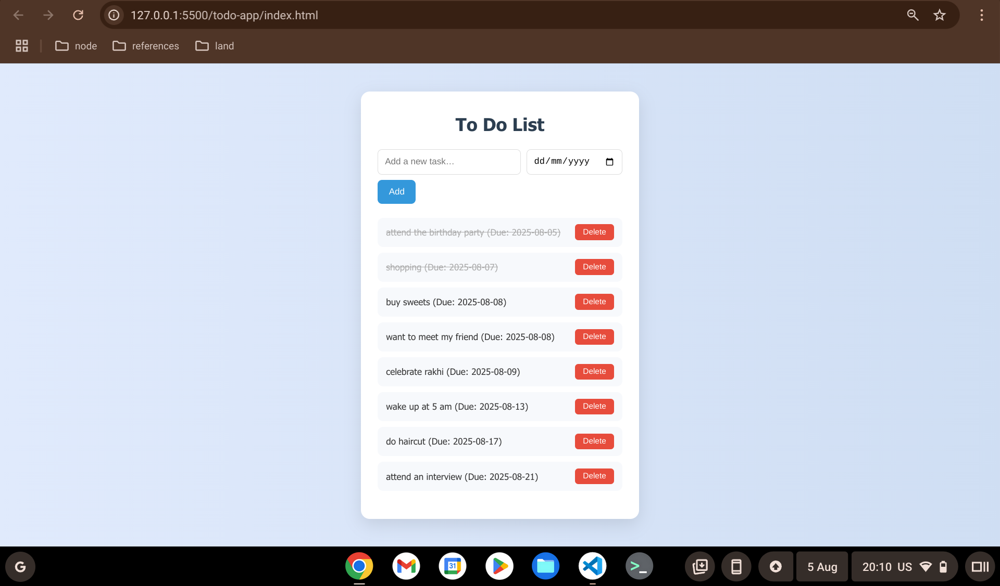
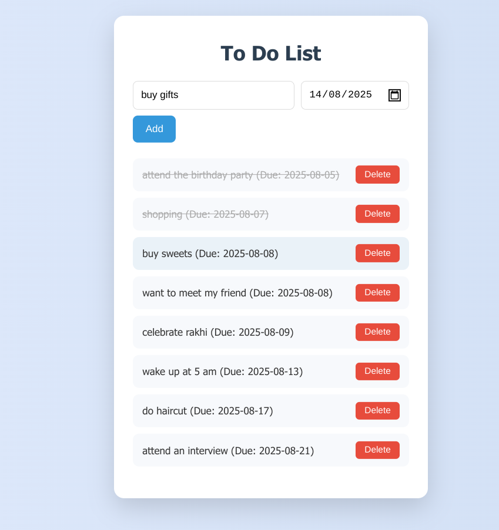
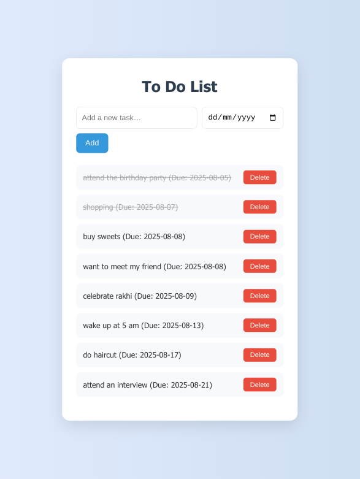
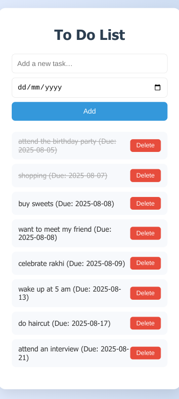

# 📝 To-Do List Web App

This is a **responsive and modern To-Do List web application** built using **HTML**, **CSS**, and **Vanilla JavaScript**.  
It allows users to add tasks with optional due dates, mark them as complete, and delete them. All data is saved locally using `localStorage`.

---

## 📌 Task Objective

**Task 2: Build a To-Do List Web App (Front-end only, using Vanilla JavaScript)**  
> Create a dynamic To-Do list where users can add, remove, and mark tasks as complete.

---

## 🔧 Tools Used

- **Visual Studio Code**
- **Chrome Browser**
- **Live Server Extension**

---

## ✨ Features

- ✅ Add tasks with optional **due date**
- ✅ **Mark tasks as complete** with a click
- ✅ **Delete** individual tasks
- ✅ **Persistent storage** using `localStorage`
- ✅ Automatically **sorts tasks by due date**
- ✅ Fully **responsive and clean UI**

---

## 📁 Project Structure

todo-list-app/
├── index.html
├── style.css
├── script.js
├── README.md
└── screenshots/


---

## 📸 Screenshots


### 📍 Main Interface


### 🗓️ Adding a Task with Due Date


### ✅ Marked Completed Task


### 🤖 Android View  

This view demonstrates the responsiveness of the To-Do App on Android devices.



---

## 🚀 Getting Started

### 1. Clone the Repository
```bash
git clone https://github.com/Aditi71/todo-list-aditidwivedi.git
cd todo-list-app
